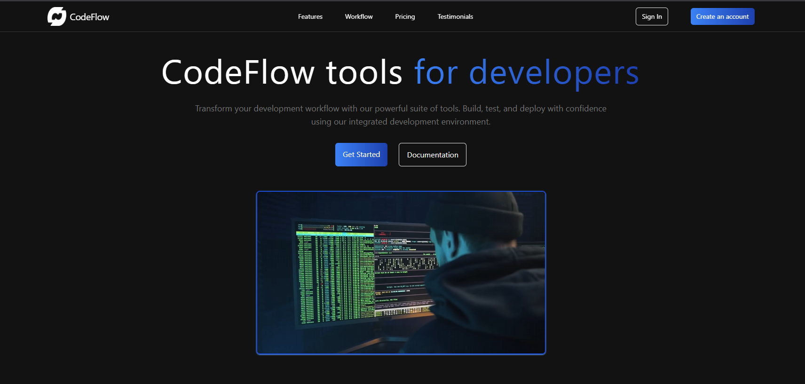
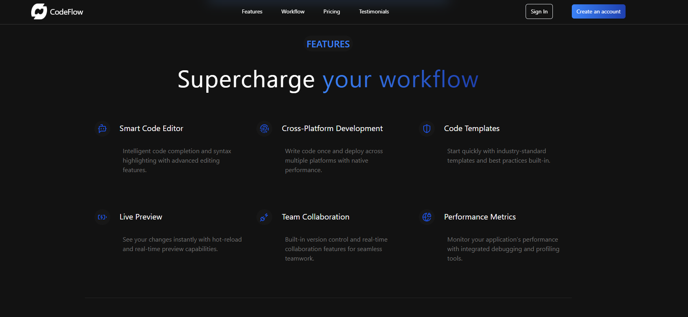
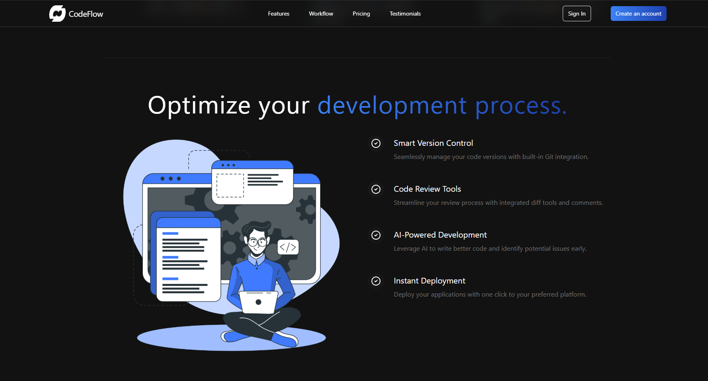
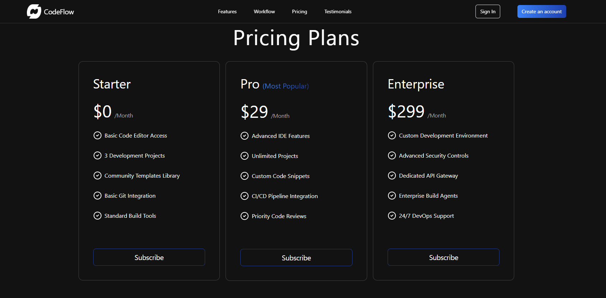
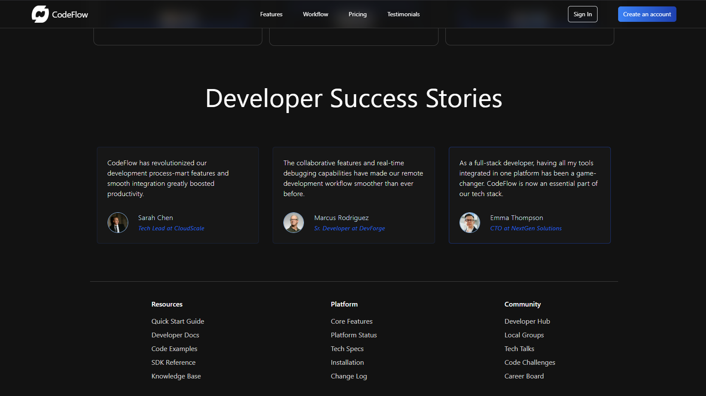

# CodeFlow - Modern Development Platform


## [🌐 Live Demo](https://codeflow-dev.netlify.app/)

## 🎯 About
CodeFlow is a modern front-end showcase project built with React and TailwindCSS. It demonstrates a sleek, responsive landing page for a development platform with features like:

- 💻 Interactive UI Components
- 🎨 Modern Design System
- 📱 Full Responsiveness
- 🔄 Smooth Animations
- 🌙 Dark Mode Aesthetics

## 📸 Landing Page Showcase

### 🚀 Hero Section

Transform your development workflow with our powerful suite of tools.

### ⚡ Features

Supercharge your workflow with smart development tools.

### 🔄 Workflow

Optimize your development process with integrated tools.

### 💰 Pricing

Flexible plans for teams of all sizes.

### 🌟 Testimonials

Trusted by developers worldwide.

## 🛠️ Built With


## 📁 Project Structure
```
React-Landing-Page/
├── src/
│   ├── assets/
│   │   ├── video1.mp4
│   │   └── images/
│   ├── components/
│   │   ├── FeatureSection.jsx
│   │   ├── Footer.jsx
│   │   ├── HeroSection.jsx
│   │   ├── Navbar.jsx
│   │   ├── Pricing.jsx
│   │   ├── Testimonials.jsx
│   │   └── Workflow.jsx
│   ├── constants/
│   │   └── index.jsx
│   ├── App.jsx
│   └── index.css
├── public/
├── index.html
├── package.json
├── tailwind.config.js
└── vite.config.js
```

## 🚀 Getting Started

1. Clone the repository
```bash
git clone https://github.com/yourusername/codeflow.git
```

2. Install dependencies
```bash
cd codeflow
npm install
```

3. Run development server
```bash
npm run dev
```

## 🎨 Features

### Modern UI Components
- Responsive Navigation
- Hero Section with Video Background
- Feature Highlights
- Pricing Tables
- Testimonials
- Footer with Quick Links

### Styling
- TailwindCSS for Utility-First Styling
- Custom Color Schemes
- Responsive Design
- Smooth Transitions

### Performance
- Optimized Asset Loading
- Smooth Scrolling
- Quick Page Load Times

## 📝 License
This project is licensed under the MIT License - see the [LICENSE](LICENSE) file for details.